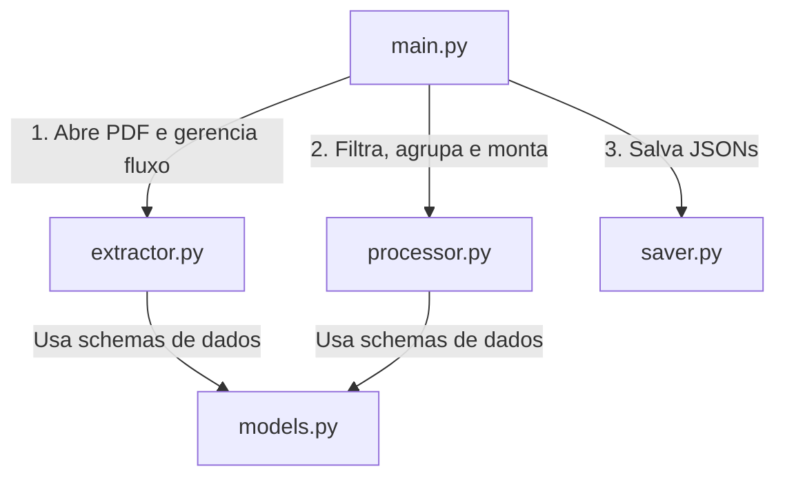

# Guia de Estudos do Extrator de Provas (Unicamp)

Este guia foi elaborado para ajudar você a compreender detalhadamente o funcionamento do código desenvolvido para a extração de provas. Focaremos nas **bibliotecas externas** utilizadas, nos **conceitos de geometria e layout**, e em **recursos avançados do Python base** aplicados no projeto, todos acompanhados de trechos de código práticos.

---

## 📂 1. Arquitetura do Projeto

O código foi dividido de forma modular, seguindo boas práticas de engenharia de software para que cada arquivo tenha uma responsabilidade única:



1. **`models.py`**: Definição das estruturas de dados estruturadas e tipadas via Pydantic. Suporta tanto questões objetivas da 1ª Fase (com `alternativas` de múltipla escolha) quanto dissertativas da 2ª Fase (através da lista de `sub_itens` compostos por objetos `SubItem`).
2. **`extractor.py`**: O motor de interação geométrica com o PDF. Abre o documento, extrai blocos de texto bruto, encontra imagens, renderiza desenhos vetoriais e salva-os.
3. **`processor.py`**: O cérebro lógico. Aplica Regex, separa enunciados de alternativas (1ª fase) ou sub-itens discursivos (2ª fase) usando quebra baseada em cabeçalhos de página, aplica o gabarito e realiza o enriquecimento via IA.
4. **`saver.py`**: Grava os dados convertidos de Pydantic em arquivos JSON no disco.
5. **`main.py` / `test_runner.py`**: Os orquestradores sequenciais da interface visual e da suíte de validação de testes gerais.
6. **`Projeto_API/`**: Uma pasta isolada contendo as bibliotecas essenciais e a interface pública `api.py` com funções programáticas prontas para importação por outros projetos.

---

## 📦 2. As Bibliotecas Externas com Exemplos de Código

### A. PyMuPDF (importado como `fitz`)
O PDF não é uma sequência de texto simples; ele é uma tela de desenho geométrica com coordenadas detalhadas.

* **Eixo X**: Cresce horizontalmente para a direita.
* **Eixo Y**: Cresce verticalmente para baixo (a origem `(0,0)` é o canto superior esquerdo).

### Exemplo 1: Abrir o PDF e Extrair Blocos de Texto
Para ler os elementos preservando suas localizações geométricas, usamos `get_text("blocks")`:
```python
import fitz

doc = fitz.open("prova.pdf")
pagina = doc[0]  # Primeira página (0-indexed)

# Obtém caixas de texto estruturadas
# Cada bloco é: (x0, y0, x1, y1, "texto do bloco", block_no, block_type)
blocos = pagina.get_text("blocks")
for b in list(blocos)[:3]:
    print(f"Coordenadas: ({b[0]:.1f}, {b[1]:.1f}) -> ({b[2]:.1f}, {b[3]:.1f})")
    print(f"Conteúdo: {b[4].strip()}\n")
```

### Exemplo 2: Renderizar e Cortar Áreas da Página (Desenhos Vetoriais)
Quando encontramos um gráfico ou tabela (desenhados por linhas e curvas vetoriais), capturamos a região e geramos uma imagem de alta resolução com zoom (escala 2x):
```python
# 'm' é um retângulo fitz.Rect contendo as coordenadas do gráfico
m = fitz.Rect(100, 200, 400, 500)

# Define uma matriz de escala (escala 2x para imagem nítida)
matrix = fitz.Matrix(2, 2)

# Gera o pixmap recortando apenas a região do retângulo
pix = pagina.get_pixmap(clip=m, matrix=matrix)
pix.save("imgs/p0_grafico.png")
```

---

### B. Pydantic (BaseModel)
Usamos o **Pydantic** para validar, tipar rigorosamente e exportar nossos dados estruturados diretamente para JSON.

#### Exemplo de Definição de Modelos (`models.py`):
```python
from pydantic import BaseModel
from typing import Optional, List

class AlternativaItem(BaseModel):
    texto: Optional[str] = None
    url_img: List[str] = []
    correta: bool = False

class Conteudo(BaseModel):
    enunciado: str
    url_img: List[str] = []
    resolucao: Optional[str] = None
    dica: Optional[List[str]] = None
    objetiva: bool

class Especificacao(BaseModel):
    disciplina: List[str]
    assunto: List[str]
    topicos: List[str]
```

#### Exemplo de Exportação Prática:
```python
# Criando a questão
questao = Questao(
    metadados=Metadados(codigo="unicamp_2026_q1", edital="unicamp", numero=1, tipo_ou_cor="Q-X", ano=2026),
    conteudo=Conteudo(enunciado="Qual é o valor de X?", objetiva=True),
    especificacao=Especificacao(
        disciplina=["Matemática"],
        assunto=["Geometria"],
        topicos=["Teorema de Pitágoras"]
    ),
    alternativas=Alternativas(
        a=AlternativaItem(texto="Opção A", correta=True),
        b=AlternativaItem(texto="Opção B")
    )
)

# Exportando para dicionário nativo e salvando em JSON
import json
dict_dados = questao.model_dump()
print(json.dumps(dict_dados, indent=2, ensure_ascii=False))
```

---

## 🧠 3. Conceitos Avançados de Python e Expressões Regulares

### A. Divisão de Alternativas Multilinhas (`re.split`)
As alternativas da Unicamp frequentemente possuem várias linhas ou parágrafos. Para separá-las mantendo o separador `a)`, `b)` etc., usamos grupos de captura em `re.split`:

```python
import re

bloco_questao = """Qual é o valor de X?
a) O valor é 10,
pois a soma resulta em dez.
b) O valor é 20,
pois o dobro é vinte."""

# O parêntese ([a-e]) cria um grupo de captura que faz o split reter as letras separadoras!
partes = re.split(r"\n\s*([a-e])\)\s*", bloco_questao)

enunciado = partes[0].strip()
alternativas = {}
for i in range(1, len(partes), 2):
    letra = partes[i]
    texto_alternativa = partes[i+1].strip()
    alternativas[letra] = texto_alternativa

print("Enunciado:", enunciado)
print("Alternativas Extraídas:", alternativas)
```

---

### B. Mapeamento de Gabarito Oficial a Partir de Texto
Conseguimos extrair todas as 72 respostas com a seguinte lógica de Regex no texto extraído do gabarito oficial:

```python
import re

texto_gabarito = """
01 A
02 B
46 C
"""

# Mapeia um número (\d+) seguido de espaço e uma letra de A a E
pares = re.findall(r"(\d+)\s*\n\s*([A-E])\s*(?:\n|$)", texto_gabarito)
respostas = {int(num): letra.lower() for num, letra in pares}

print("Gabarito Mapeado:", respostas)
# Saída: {1: 'a', 2: 'b', 46: 'c'}
```

---

### C. Detecção Dinâmica de Edital e Ano
Desenvolvemos uma lógica inteligente para identificar a prova a partir do nome do arquivo PDF, permitindo isolar as saídas por pastas dinâmicas:

```python
import re
import os

def detectar_edital_ano(pdf_path):
    nome_arquivo = os.path.basename(pdf_path).lower()
    
    # Detecção de edital
    edital = "unicamp"
    if "enem" in nome_arquivo:
        edital = "enem"
    elif "fuvest" in nome_arquivo:
        edital = "fuvest"
        
    # Busca por 4 dígitos de ano
    ano = 2026
    match_ano = re.search(r"\b(20[0-9]{2})\b", nome_arquivo)
    if not match_ano:
        match_ano = re.search(r"\b(20[0-9]{2})\b", pdf_path)
        
    if match_ano:
        ano = int(match_ano.group(1))
        
    return edital, ano
```

---

## 🤖 4. Integração com Inteligência Artificial (Google Gemini)

> [!IMPORTANT]
> A IA realiza o enriquecimento automático de campos como `area`, `disciplina`, `assunto`, `topico`, `resolucao` e `dica` de forma estruturada. 
> Usamos a nova SDK do Google GenAI (`google-genai`) e o modelo **`gemini-2.5-flash`** que suporta **Structured Outputs** (saídas JSON validadas via Pydantic).

Para otimizar a velocidade, reduzir custos de rede e tokens redundantes, implementamos várias evoluções arquiteturais na integração com a IA:

1. **Processamento em Lotes (Batching) de 20 questões**: Enviamos até 20 questões em uma única chamada de API. Isso reduz em até 95% o número de requisições de rede.
2. **Nomenclatura Estruturada de Metadados**:
   - `area` (str): Ex: "Exatas", "Linguagens", "Humanas"
   - `disciplina` (List[str]): Ex: `["Física"]`, `["Química", "Biologia"]` (multidisciplinar)
   - `assunto` (List[str]): Temas amplos, ex: `["Termodinâmica"]`
   - `topico` (List[str]): Tópicos específicos, ex: `["Dilatação Térmica"]`
3. **Pacing Inteligente (Espaçamento Dinâmico)**: O script mede a duração da requisição anterior e dorme apenas o tempo restante necessário para atingir 4,5 segundos (cota de 15 RPM). Se a requisição durar mais que 4,5s, o script não dorme nada, maximizando o desempenho.
4. **Dupla Defesa (Double-Defense) de Tags**: 
   - *Defesa 1 (Prompt)*: Instruímos a IA no prompt a retornar apenas tópicos conceituais nas listas.
   - *Defesa 2 (Filtro em Python)*: Passamos os resultados por um filtro programático (`TAG_BLACKLIST`) case-insensitive para remover termos inválidos (ex: "unicamp", "vestibular").
5. **Caminhos Relativos**: Gravamos as referências de imagem no formato `./imgs/nome_da_imagem.webp` para garantir portabilidade completa.

---

## 🔌 6. API Programática (`Projeto_API/`)

Para projetos que necessitam realizar a extração sem interações de terminal ou interface gráfica, o pacote expõe o módulo principal **`extratorUNICAMP`**. Ele disponibiliza tanto as funções detalhadas originais quanto **atalhos simplificados e altamente intuitivos**:

1. **`objetiva(caminho_prova, caminho_gabarito=None)`**: Extrai em memória (retorna `List[Questao]`) a prova objetiva da 1ª fase (antiga `extrair_prova_objetiva`).
2. **`dissertativa(caminho_prova)`**: Extrai em memória (retorna `List[Questao]`) a prova dissertativa da 2ª fase (antiga `extrair_prova_dissertativa`).
3. **`salvar_objetiva(caminho_prova, pasta_destino, caminho_gabarito=None)`**: Extrai e grava os JSONs individuais e imagens na pasta destino (antiga `extrair_e_salvar_prova_objetiva`).
4. **`salvar_dissertativa(caminho_prova, pasta_destino)`**: Extrai e grava os JSONs individuais e imagens na pasta destino (antiga `extrair_e_salvar_prova_dissertativa`).

### Exemplo Rápido de Uso da API:
```python
import extratorUNICAMP

# Retorna lista de objetos tipados do Pydantic instantaneamente
questoes = extratorUNICAMP.objetiva("prova.pdf", "gabarito.pdf")
print(f"Total de questões carregadas em memória: {len(questoes)}")
```

---

## 🚀 7. Comandos Úteis do Sistema

* **Executar o Extrator com Interface Gráfica Interativa (`main.py`):**
  ```powershell
  & "C:\Python314\python.exe" main.py
  ```

* **Executar a Suíte de Validação e Testes Locais Geral (`test_runner.py`):**
  ```powershell
  & "C:\Python314\python.exe" test_runner.py
  ```

* **Executar os Testes da API Programática (`test_api.py`):**
  ```powershell
  & "C:\Python314\python.exe" test_api.py
  ```

* **Executar o Servidor Web API com Documentação FastAPI (`app.py`):**
  ```powershell
  & "C:\Python314\python.exe" app.py
  ```

